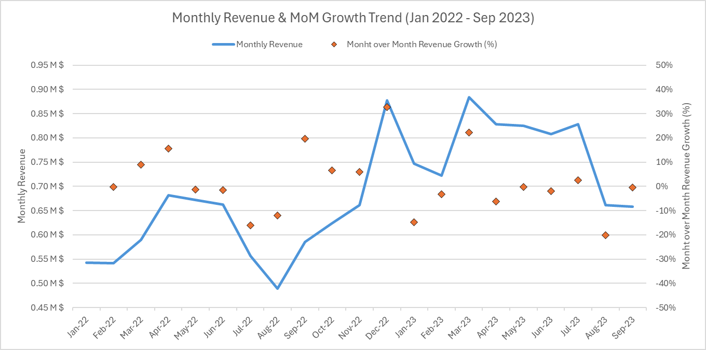

# Introduction
🧸 Dive into the toy retail industry! Focusing on **Maven Toys** (a fictitious chain in Mexico), this project explores 💰 revenue trends, 📦 inventory efficiency, and 📉 product profitability. It demonstrates how SQL can drive high-level business strategy.  

🔍 **SQL queries?** Check them out here: [sql_queries folder](/sql_queries/)

# Background
Driven by a quest to solve real-world operational challenges, this project was born from a desire to apply advanced SQL techniques to a large-scale retail dataset. The goal was not just to write queries, but to answer critical business questions about where the company is losing money and where it should expand.

The data contains over **800,000 sales records** across 50 locations, including details on products, inventory, and daily transactions.

### The questions I wanted to answer through my SQL queries were:

1. What is the overall financial health and growth of the company?
2. How is revenue trending month-over-month?
3. Which store locations are the most efficient (Revenue vs. Volume)?
4. Which products drive the bulk of the revenue (The 80/20 Rule)?
5. Which products are the least profitable and should be dropped?
6. What is the volume of products currently out of stock?
7. How much revenue is being lost daily due to these stockouts?
8. What are the daily sales patterns to optimize staffing?

# Tools I Used
For my deep dive into the retailer's performance, I harnessed the power of several key tools, focusing heavily on database manipulation:

- **SQL:** The backbone of my analysis, used for 100% of the data extraction, cleaning, and logic implementation (CTEs, Window Functions, Aggregations).
- **PostgreSQL:** The chosen database management system to host and query the raw CSV files.
- **Visual Studio Code:** My go-to for database management and executing SQL scripts.
- **Git & GitHub:** Essential for version control and sharing my SQL scripts and analysis.
- **Excel:** Used **strictly for visualization** (creating the charts/heatmaps based on the SQL outputs). 

# The Analysis
Each query for this project aimed at investigating specific operational bottlenecks. Here’s how I approached each question:

### 1. Overall Executive Performance
To evaluate the true financial momentum of the business, I moved beyond simple totals. I calculated the **Trailing 12 Months (TTM)** revenue and utilized a **Year-to-Date (YTD)** comparison to neutralize seasonality bias.

* **View SQL Query:** [1_overall_performance.sql](project_sql/1_overall_performance.sql)

Here's the executive snapshot of the performance:
- **Current Run Rate (TTM):** The company generated **$9.1M** in revenue over the last 12 months.
- **Real Growth:** By comparing normalized YTD periods, we see a **30.9%** increase in revenue and a **40.8%** increase in sales volume, indicating strong organic growth.

### 2. Monthly Revenue & Growth Trends
To understand seasonality, I analyzed sales trends over the 18-month period, using Window Functions (`LAG`) to calculate Month-over-Month growth rates.

* **View SQL Query:** [2_monthly_sales_trend.sql](project_sql/2_monthly_sales_trend.sql)

Here's the breakdown of the financial trends:
- **Seasonality:** A massive spike is visible in December (Holiday Season), followed by a return to baseline.
- **Stability:** Despite fluctuations, the overall trend line is positive year-over-year.

*Dual-axis chart visualizing revenue vs. growth percentage*

### 3. Location Efficiency Analysis
I wanted to know not just which store sells the *most*, but which is the most *efficient*. I compared the number of stores in a location type against their average revenue.

* **View SQL Query:** [3_location_profitability.sql](sql_queries/3_location_profitability.sql)

Here's the breakdown of store efficiency:
- **The Airport Surprise:** While "Downtown" has the volume, **Airport** locations generate the highest revenue *per store*.
- **Expansion Opportunity:** This suggests a strategy of opening more Airport locations rather than Residential ones.

*Bar chart comparing total store count vs. average revenue efficiency*

### 4. Product Strategy: The Pareto Principle (80/20)
To optimize the catalog, I used Window Functions to calculate the cumulative percentage of revenue contributed by products. This identifies the "Vital Few" vs. the "Trivial Many".

* **View SQL Query:** [4_pareto_analysis.sql](sql_queries/4_pareto_analysis.sql)

Here's the breakdown of product contribution:
- **Vital Few:** Approximately **20-25% of products contribute to 80% of total revenue**.
- **Action:** These products must never be out of stock.

*Pareto Chart showing the cumulative revenue curve*

### 5. Least Profitable Products
Identifying the bottom performers is just as important as finding the winners. This query isolates products with the lowest profit margins or total profit contribution.

* **View SQL Query:** [5_least_profitable_products.sql](sql_queries/5_least_profitable_products.sql)

Here's the breakdown:
- **Discontinuation Candidates:** Products like "Classic Dominoes" and certain card games are generating minimal profit and cluttering the inventory.
- **Strategy:** Recommending a clearance sale followed by discontinuation.

*Bar chart showing the bottom 5 products by profitability*

### 6. Stockout Volume Analysis
Before calculating the financial impact, I needed to assess the scale of the inventory problem. This query counts how many units are currently out of stock across the network.

* **View SQL Query:** [6_stockout_product_volume.sql](sql_queries/6_stockout_product_volume.sql)

- **Insight:** Stockouts are not isolated; they are widespread across major high-traffic stores, indicating a systemic supply chain issue rather than a local management error.

### 7. Inventory Risk: Daily Lost Revenue
The most critical part of the analysis was identifying where money is being left on the table. I calculated potential lost revenue for high-demand items that are out of stock.

* **View SQL Query:** [7_inventory_risk_analysis.sql](sql_queries/7_inventory_risk_analysis.sql)

Here's the breakdown of inventory risk:
- **Critical Gaps:** The "Magic Sand" product at the Zacatecas location is causing the highest daily loss.
- **Immediate Fix:** These top 10 items require immediate restocking to capture lost sales.

*Bar graph visualizing the estimated daily revenue loss per stockout item*

### 8. Daily Sales Patterns
To assist operations, I analyzed which days of the week generate the most revenue for each store using Pivot logic.

* **View SQL Query:** [8_daily_sales_patterns_by_store.sql](sql_queries/8_daily_sales_patterns_by_store.sql)

- **Peak Days:** Saturdays are consistently the busiest days across almost all locations.
- **Staffing:** Schedules should be adjusted to maximize staff presence on weekends to handle the volume shown in the heatmap.

*Heatmap table showing sales intensity by day of the week*

# What I Learned

Throughout this project, I deepened my SQL toolkit significantly to handle retail scenarios:

- **🧩 Advanced CTEs & Window Functions:** Mastered using `WITH` clauses to break down complex logic and `SUM() OVER()` or `LAG()` for cumulative totals and growth trends.
- **📉 Business Logic Implementation:** Learned how to translate business concepts (like "Stockout Loss" or "Pareto Principle") into executable SQL code.
- **🧹 Data Cleaning & Casting:** Handled raw data inconsistencies, date formatting (`TO_CHAR`), and type casting directly within the database.

# Conclusions

### Insights
From the analysis, several strategic insights emerged:

1.  **Prioritize Airport Expansion:** Despite having fewer stores, Airport locations perform significantly better per unit than Residential ones.
2.  **Fix the Supply Chain:** The company is bleeding revenue on daily stockouts of its most popular items (like Magic Sand). A targeted restocking plan is needed.
3.  **Optimize the Catalog:** A large portion of the product catalog contributes very little to the bottom line (Long Tail). These should be candidates for discontinuation.
4.  **Staffing Optimization:** Saturdays are consistently the busiest days, requiring maximum staff allocation to prevent service bottlenecks.

### Closing Thoughts
This project highlights that while **Excel** is great for the final chart, **SQL** is the indispensable engine for processing the logic, relationships, and aggregations required to derive these insights from raw data.
